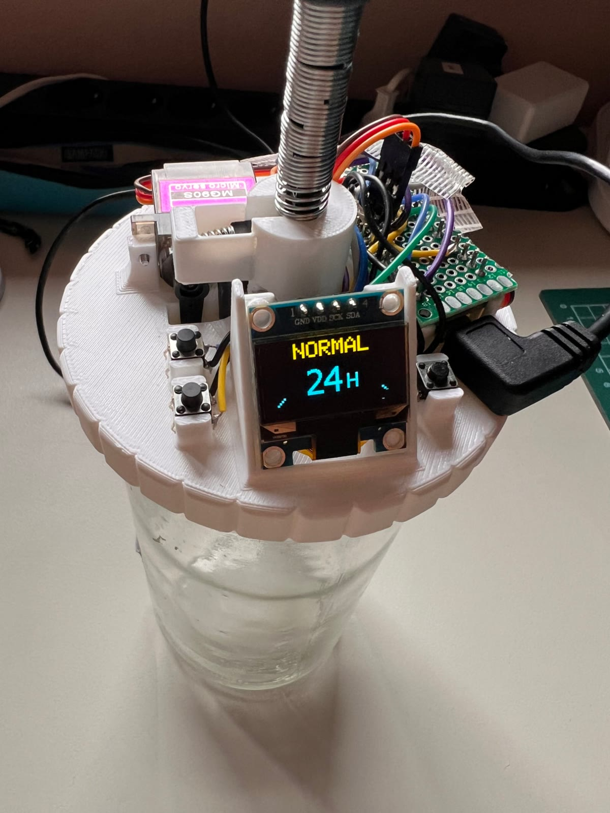
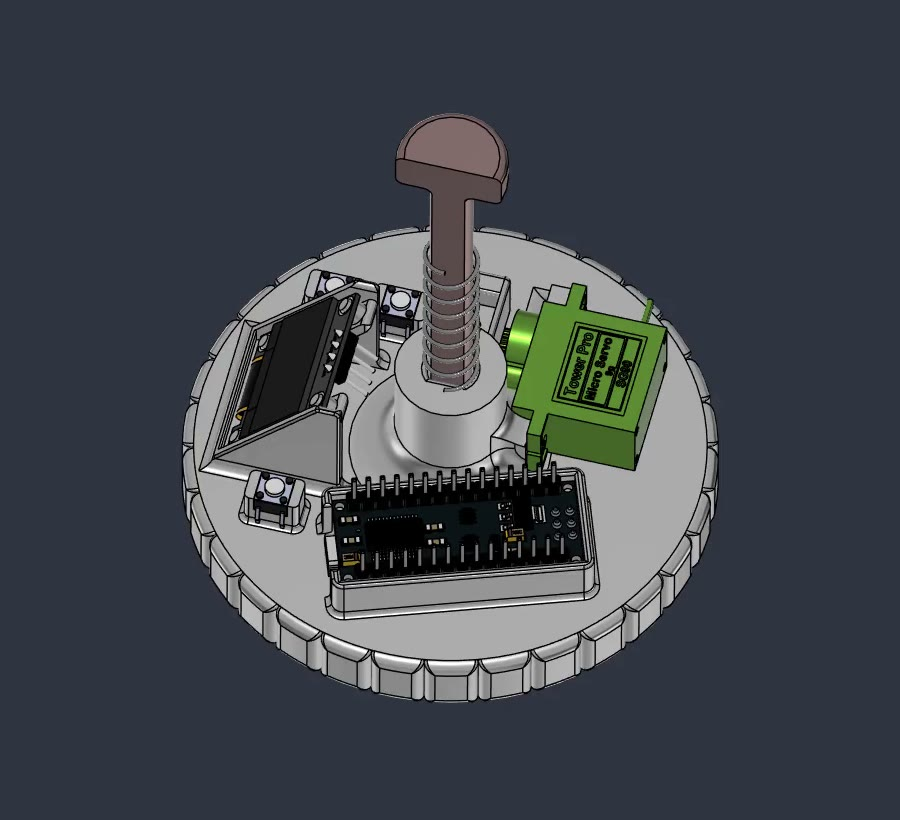
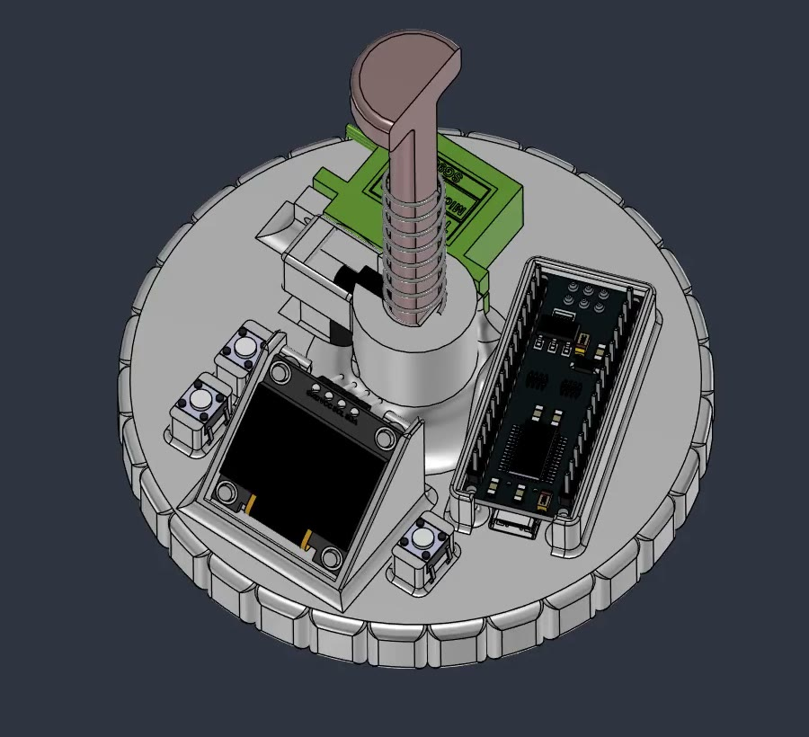
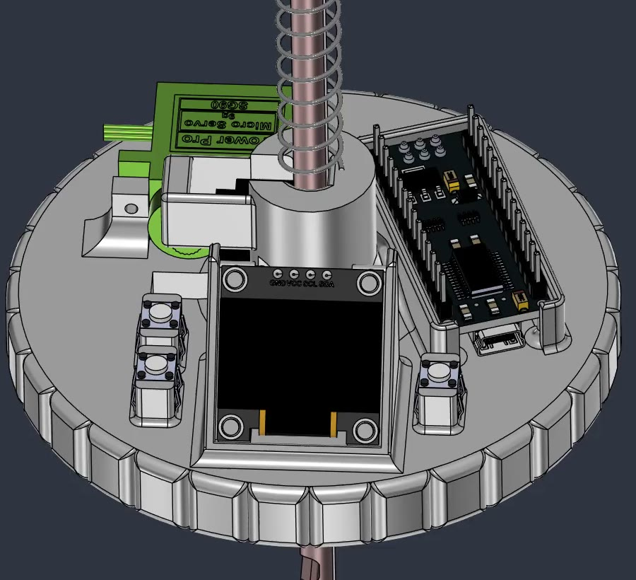
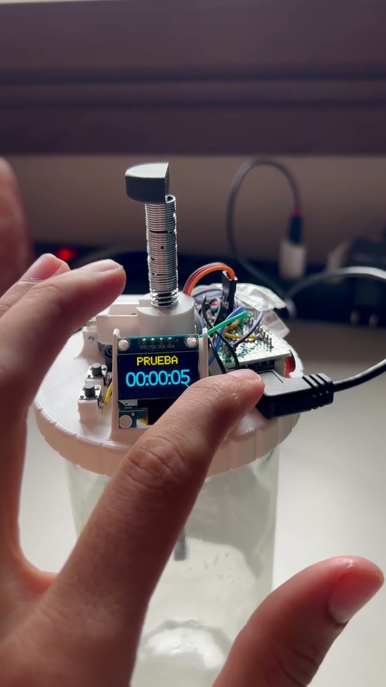
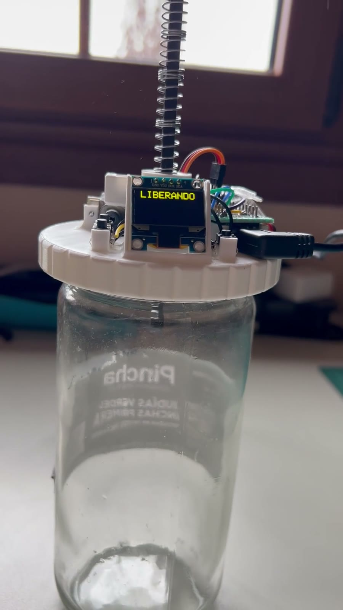
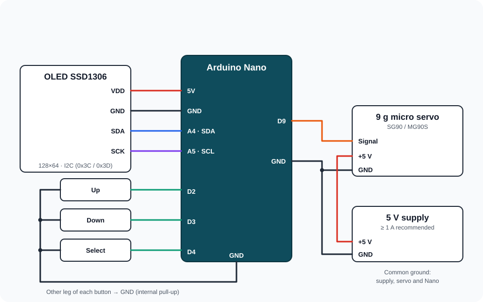

# Automatic Kefir Jar Lid · Arduino Nano

Firmware and build guide for a **3D-printed jar lid that automates milk kefir fermentation**. Pick 12, 24 or 36 hours on a small OLED and, when the countdown ends, a micro servo releases a spring-loaded plunger that lifts the grains out of the milk. No Wi-Fi, no apps and no accounts: an Arduino Nano, three buttons and a display.

  

## Gallery

### 3D model (Fusion 360)

| Overview | Front | Close-up |
| :---: | :---: | :---: |
|  |  |  |

### Real build

| Finished lid | Countdown running | Plunger released |
| :---: | :---: | :---: |
|  |  |  |

The two photos on the right were taken with an earlier firmware build that showed Spanish labels on the display; the current firmware shows the same screens in English (TEST, RELEASING…).

> **Food and mechanical safety.** Keep all electronics on top of the lid, away from the wet area. Any part that touches the milk or the grains must be food-safe and easy to clean. Always test the mechanism without milk before using it. The timer does not replace keeping an eye on your kefir: temperature, the amount of milk and the state of the grains all change the result.

## Repository contents

| Path | Description |
| --- | --- |
| [`KefirJarLidNano/KefirJarLidNano.ino`](KefirJarLidNano/KefirJarLidNano.ino) | Arduino Nano firmware. |
| [`KefirJarLidNano/README.md`](KefirJarLidNano/README.md) | Quick flashing guide. |
| [`BOM.md`](BOM.md) | Bill of materials with links to several shops. |
| [`docs/images/`](docs/images) | Photos, 3D renders and the wiring diagram. |
| `README.md` | This full guide. |
| [`LICENSE.md`](LICENSE.md) | Personal-use licence. |

The STL models of the lid, the plunger and the release clamp are distributed separately in the project's downloadable package.

## Bill of materials

See **[BOM.md](BOM.md)** for the full list with purchase links (Arduino Store, Amazon, AliExpress and eBay). In short:

**Electronics**

- Classic Arduino Nano (ATmega328P, 5 V, 16 MHz).
- 0.96" SSD1306 OLED, 128×64 pixels, I2C (address `0x3C` or `0x3D`).
- 9 g micro servo (SG90, MG90S or similar).
- 3 tactile push buttons (up, down and select).
- Jumper (Dupont) wires and some simple soldering.
- 5 V USB supply for the Nano and, recommended, a 5 V supply of at least 1 A for the servo.
- Optional: a 470–1000 µF capacitor to absorb the servo's current peaks.

**Mechanics**

- 3D-printed parts: lid, plunger and release clamp.
- Compression spring, **8 mm diameter and about 10 cm** long, to raise the plunger.
- Spring of about **3 mm diameter and 5 cm**, cut to size, for the release latch.
- A few **M3** screws.
- A glass jar with a **TO 82** screw top.

## Wiring

  

| Component | Component pin | Arduino Nano | Note |
| --- | --- | --- | --- |
| OLED | VDD / VCC | 5V | Most 0.96" modules accept 3.3 V and 5 V; check yours. |
| OLED | GND | GND | Common ground. |
| OLED | SDA | A4 | I2C data (fixed pin on the Nano). |
| OLED | SCK / SCL | A5 | I2C clock (fixed pin on the Nano). |
| Servo | Signal (orange/yellow) | D9 | PWM control. |
| Servo | +5 V (red) | External 5 V supply | ≥ 1 A recommended. |
| Servo | GND (brown/black) | GND | Also joined to the external supply's GND. |
| Up button | One leg | D2 | Other leg to GND. |
| Down button | One leg | D3 | Other leg to GND. |
| Select button | One leg | D4 | Other leg to GND. |

- The buttons use the Nano's **internal pull-up resistors**: each one goes only between its pin and GND, with no external resistor.
- On a four-leg tactile switch, the two legs on each side are already connected. Wire it using legs on **opposite sides**; otherwise pressing it changes nothing.
- If your OLED module only accepts 3.3 V signals, do not connect SDA/SCL directly to the 5 V Nano.

### Powering the servo

A servo can draw current peaks that reset the Nano when it is powered from the Nano's 5V pin while on USB. The reliable setup is:

1. Power the Nano over USB.
2. Power the servo's red wire from a 5 V supply of at least 1 A.
3. Join that supply's GND to the Nano's GND.
4. Connect the servo signal to D9.

A 470–1000 µF capacitor between 5 V and GND, close to the servo, helps absorb those peaks.

## Flashing the firmware

1. Install [Arduino IDE 2](https://www.arduino.cc/en/software).
2. In **Tools → Manage Libraries**, install:
   - `SSD1306Ascii` (by Bill Greiman).
   - `Servo`.

   `Wire` and `EEPROM` ship with the Arduino AVR core.
3. Open [`KefirJarLidNano/KefirJarLidNano.ino`](KefirJarLidNano/KefirJarLidNano.ino). The folder must keep the same name as the `.ino` file.
4. In **Tools → Board**, select **Arduino Nano**.
5. In **Tools → Processor**, select **ATmega328P**. If uploading fails on a clone, try **ATmega328P (Old Bootloader)**.
6. Select the Nano's port in **Tools → Port** and click **Upload**.

At start-up, the Serial Monitor (115200 baud) reports the address where the OLED was found and prints the list of commands.

## Using the buttons

- **Up / down**: switch between **TEST** (5 s), **QUICK** (12 h), **NORMAL** (24 h) and **LONG** (36 h).
- **Select**: starts the option on screen. The 5-second test runs the full release cycle so you can check the mechanism.
- **Hold select for 1.5 s** on a preset: edit its duration in one-hour steps; select saves it.
- **Hold up or down for 1.5 s**: opens **OPTIONS**:
  - `TIME`: manual duration from 0 minutes to 72 hours in 30-minute steps; select starts it.
  - `TEST`: opens and closes the servo once.
  - `SERVO`: sets the **CLOSED** angle, the **OPEN** angle and how many seconds it stays open (**HOLD**).
  - `EXIT`.
- **While fermenting**: select pauses or resumes; holding it for 1.5 s **cancels without releasing** the grains.

The countdown is shown in hours and minutes and is only redrawn when the minute changes (the 5-second test shows seconds).

The 12, 24 and 36-hour presets are starting points for cow's milk and active grains at room temperature: 12 h usually gives a milder kefir, 24 h is the usual rhythm and 36 h a stronger option.

## Using it without buttons: serial console

Connect the Nano over USB, open the **Serial Monitor** at **115200 baud** and choose `Newline` (or `Both NL & CR`).

| Command | Action |
| --- | --- |
| `HELP` | Lists every command. |
| `STATUS` | Shows the settings and the remaining time. |
| `DURATION 14` | Saves a 14-hour duration. |
| `DURATION 12 30` | Saves 12 hours and 30 minutes. |
| `START` | Starts with the saved duration. |
| `START 14` / `START 12 30` | Saves the given duration and starts. |
| `PAUSE` / `RESUME` | Pauses or resumes the fermentation. |
| `CANCEL` | Stops the timer without releasing the grains. |
| `TEST` | Runs one open-and-close cycle of the servo. |
| `CLOSE` | Moves the servo to the closed position. |
| `CLOSED 0` | Saves 0° as the closed position and moves the servo there. |
| `RELEASE 60` | Saves 60° as the release position. |
| `HOLD 3` | Saves 3 seconds held open. |

Commands are case-insensitive. The Spanish aliases from earlier versions (`AYUDA`, `INICIAR`, `PAUSA`…) are still accepted. Buttons and console can be used at the same time, and every button press is echoed on the Serial Monitor, which is handy to check the wiring.

## First calibration

The defaults are **0° closed**, **60° open** and **3 s** held open. Every build needs its own values:

1. Fit the lid without milk or grains.
2. In `OPTIONS → SERVO → CLOSED`, set the angle where the plunger is held without the servo straining.
3. In `OPEN`, set the angle where the plunger is released reliably.
4. Run `TEST` several times and check that nothing rubs or jams.
5. Only when it works repeatably, add the milk and the grains.

## Power cuts

Settings and the countdown are saved to the Nano's EEPROM when starting, pausing, resuming or cancelling, and every minute while fermenting. After a power cut the timer resumes from the last saved minute: **time without power is not counted**, so the grains are never released unexpectedly when power returns. Counting power cuts precisely would require a battery-backed real-time clock such as a DS3231.

## Troubleshooting

**The display stays blank.** Check that SDA goes to A4, SCL to A5, and that VDD and GND are correct. The Serial Monitor reports whether the OLED was found at `0x3C` or `0x3D`; the console keeps working without a display.

**A button does nothing.** Open the Serial Monitor: every press should print `Button pressed`. If it does not, check that the wire reaches D2, D3 or D4 and that you used legs on opposite sides of the switch.

**The Nano resets when the servo moves.** The servo is drawing more current than USB can supply. Power it from a separate 5 V supply with a common GND and add the capacitor.

## Licence

Personal, non-commercial use. See [LICENSE.md](LICENSE.md).
